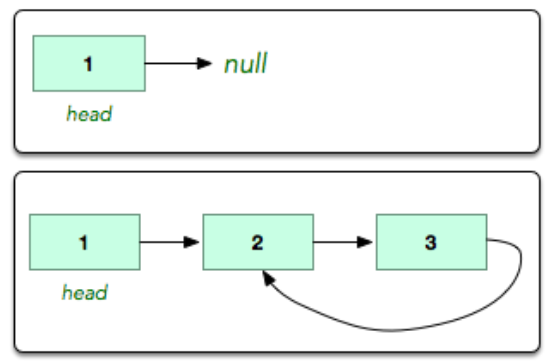

## Circular Linked List
A linked list is said to contain a cycle if any
node is visited more than once while traversing
the list. Given a linked list, determine if it 
contains a cycle. Example linked lists are shown 
below.




## Sample Input
The first input is an integer reepresenting the 
index of the node being revisited. The second
input is an integer that represents the number
of nodes in the linked list *n*. This is followed 
by *n* line of inputs, each an integer, that is 
the data held by the node.
```
1
3
1
2
3
```
Here, the tail of the linked list is connected 
to the index 1 of the node; i.e 2nd element of 
the node just like in the example figure.

## Output
Print if the linked list is circular or not circular.

